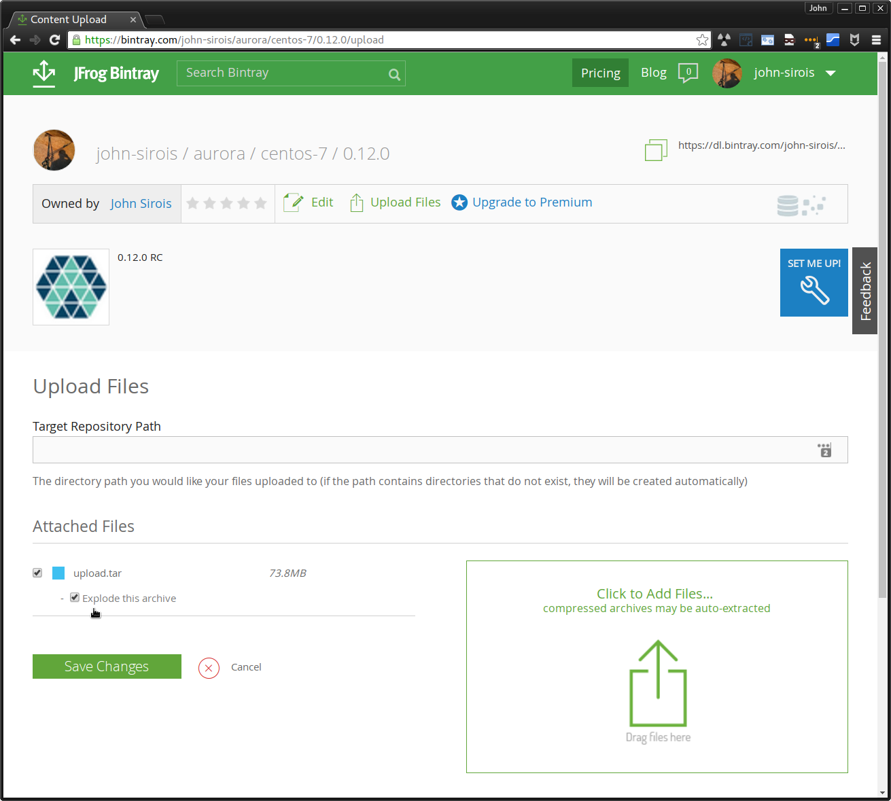
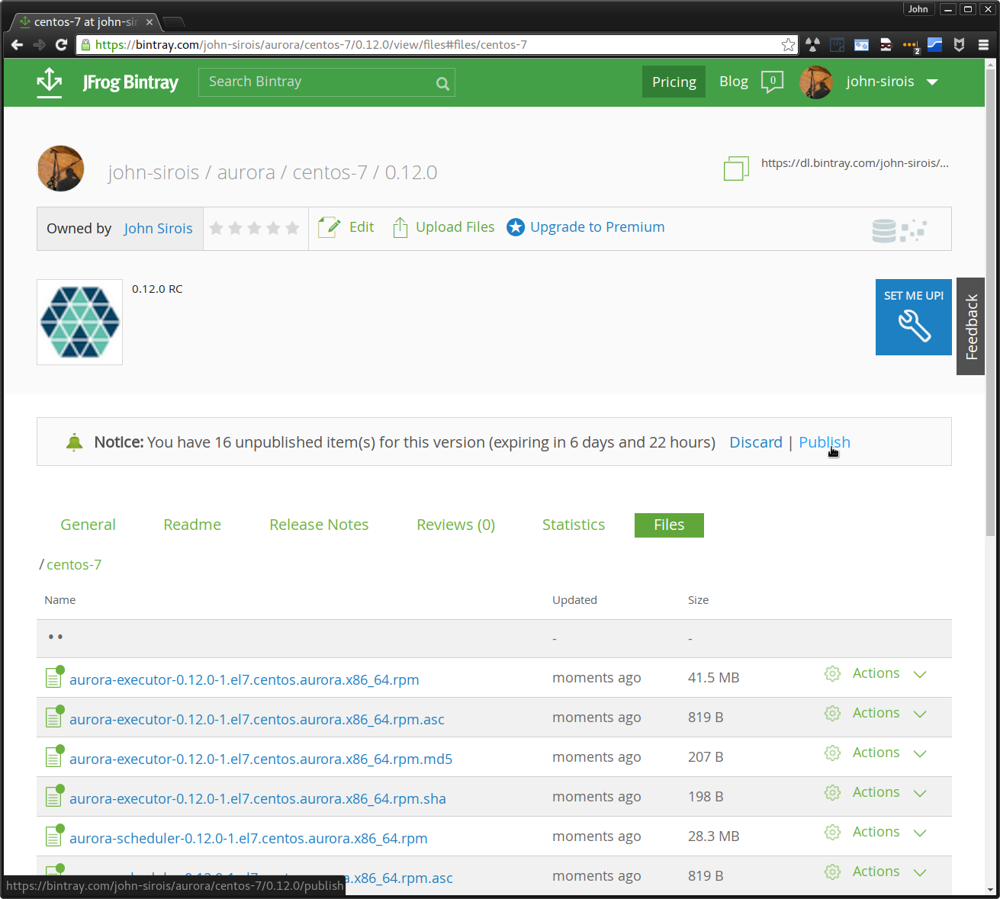

## Packaging for Apache Aurora

This repository maintains configuration and tooling for building binary
distributions of [Apache Aurora](https://aurora.apache.org/).

### Building a binary

Binaries are built within Docker containers that provide the appropriate build
environment for the target platform.  You will need to have a working Docker
installation before proceeding.

1. Fetch a source distribution, such as an [official one](https://aurora.apache.org/downloads/).
   Alternatively, you can also build from an arbitrary git commit by instead preparing sources
from the Aurora source repository:

        git archive --prefix=apache-aurora-$(cat .auroraversion)/ -o snapshot.tar.gz HEAD

2. Run the builder script, providing the distribution platform and the source
   distribution archive you downloaded in (1).  The example below will build
   Aurora 0.9.0 debs for Ubuntu Trusty.

        ./build-artifact.sh builder/deb/ubuntu-trusty \
          ../apache-aurora-0.9.0.tar.gz \
          0.9.0

When this completes, debs will be placed in `dist/builder/deb/ubuntu-trusty/`.

### Creating a release candidate

Release candidates are hashed and signed binaries that are uploaded to bintray for
easy access and testing by voters.  You will need to have a [bintray](https://bintray.com/)
account and a generic repo created for the purpose of uploading the release candidate binaries
in order to proceed.

#### Cut a branch and build the binaries

The example below is for the 0.12.0 release where upstream is https://git-wip-us.apache.org/repos/asf/aurora-packaging:

    git checkout -b 0.12.x upstream/master

Now run the [Building a binary](#building-a-binary) procedure detailed above.

#### Hash, sign and upload the binaries

Run the following which will create a tarball for each distribution platform that can be uploaded to bintray:

    ./build-support/release/release-candidate
    Signing artifacts for centos-7...
    Created archive for centos-7 artifacts at /home/jsirois/dev/aurora/jsirois-aurora-packaging/artifacts/aurora-centos-7/dist/rpmbuild/RPMS/upload.tar.
    Signing artifacts for debian-jessie...
    Created archive for debian-jessie artifacts at /home/jsirois/dev/aurora/jsirois-aurora-packaging/artifacts/aurora-debian-jessie/upload.tar.
    Signing artifacts for ubuntu-trusty...
    Created archive for ubuntu-trusty artifacts at /home/jsirois/dev/aurora/jsirois-aurora-packaging/artifacts/aurora-ubuntu-trusty/upload.tar.
    All artifacts prepared for upload to bintray.

In the bintray UI, create a new version in your release-candidate repo, for example '0.12.0'.  Then, in the version UI you can
upload the tarballs, ensuring you select 'Explode this archive'.

Finally, 'publish' the results.

### Adding a new distribution platform

There are only two requirements for a 'builder' to satisfy:

- a `Dockerfile` to provide the repeatable build environment
- a `build.sh` script that creates artifacts

Please see the makeup of other builders for examples.
